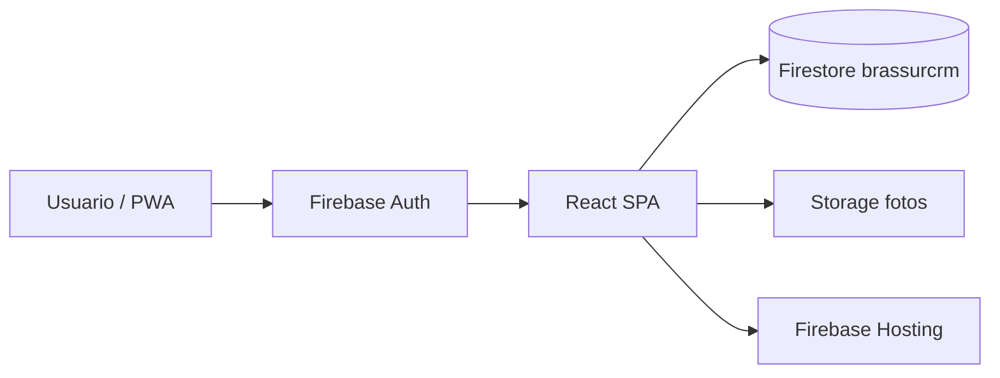

# CRM BRASSUR

**CRM interno para gestión de proveedores y desarrollo comercial** en BRASSUR — materiales metálicos reciclables (chatarra, hierro, aluminio, cobre, inox, etc.).

Centraliza proveedores, contactos, oportunidades, actividades, seguimientos, inteligencia comercial, calidad de datos, timeline auditable y fotos de visita en campo (PWA).

| | |
|---|---|
| **Producción** | https://brassurcrm.web.app |
| **Firebase** | Proyecto `crm-brassur` · Firestore `brassurcrm` |
| **Documentación Firebase** | [docs/firebase-setup.md](docs/firebase-setup.md) |

---

## Descripción

CRM web de uso interno del equipo comercial. Permite:

- Registrar y priorizar **proveedores** con ficha completa.
- Gestionar **contactos**, **actividades** y **oportunidades de compra**.
- Planificar el día con **Hoy** y **Seguimientos** (vencidos, hoy, próximos 7 días).
- Analizar el negocio con **Inteligencia Comercial** y mejorar registros con **Calidad de Datos**.
- Capturar **fotos de visita** sin conexión estable al dato (subida en campo, asignación posterior).
- Mantener un **timeline** por proveedor de eventos automáticos y notas manuales.
- Cargar la base inicial con **Importador Excel**.

Acceso protegido con Firebase Authentication (email y contraseña). Sin sesión válida no hay acceso a módulos.

---

## Stack

| Tecnología | Uso |
|------------|-----|
| **React** 19 | Interfaz y componentes |
| **Vite** 8 | Build y dev server |
| **Firebase** | Plataforma backend |
| **Firestore** | Base `brassurcrm` (no la instancia default) |
| **Storage** | Fotos de visitas |
| **Firebase Auth** | Login email / contraseña |
| **PWA** | `vite-plugin-pwa`, instalable en móvil y escritorio |
| React Router 7 | Navegación SPA |
| `xlsx` | Importación y exportación Excel |

---

## Funciones

| Módulo | Ruta | Resumen |
|--------|------|---------|
| **Dashboard** | `/` | KPIs, accesos rápidos, alertas (seguimientos, fotos pendientes). |
| **Proveedores** | `/proveedores` | Alta, edición, ficha (contactos, oportunidades, actividades, timeline, fotos). |
| **Contactos** | `/contactos` | Personas vinculadas a proveedores. |
| **Actividades** | `/actividades` | Llamadas, WhatsApp, reuniones, visitas, email. |
| **Oportunidades** | `/oportunidades` | Pipeline de compra (material, volumen, precios, fechas). |
| **Seguimientos** | `/seguimientos` | Vista unificada de fechas de seguimiento y compras esperadas. |
| **Hoy** | `/hoy` | Centro de trabajo diario, acciones rápidas, progreso del día. |
| **Inteligencia Comercial** | `/inteligencia` | KPIs, ranking, gráficos, recomendaciones, export Excel. |
| **Calidad de Datos** | `/calidad-datos` | Duplicados, completitud, score, tiers y mejoras sugeridas. |
| **Timeline** | En ficha proveedor | Historial filtrable; eventos automáticos + notas rápidas. |
| **Fotos** | `/fotos` | Bandeja: captura/subida pendiente y asignación a proveedor. |
| **Importador Excel** | `/importar-proveedores` | Carga masiva de proveedores con vista previa y validación. |
| **PWA** | Global | Instalación, iconos, service worker, banner de instalación. |

---

## Instalación

### Requisitos

- Node.js **18+**
- Proyecto Firebase configurado (`crm-brassur`)
- Firebase CLI (para deploy): `npm i -g firebase-tools`

### Pasos

```bash
# Clonar o abrir el repositorio
cd "CRM BRASSUR"

# Variables de entorno (no commitear .env)
cp .env.example .env
# Completar VITE_FIREBASE_* según Firebase Console

npm install
npm run dev
```

Abrir la URL de Vite (por defecto `http://localhost:5173`).

### Variables de entorno

```env
VITE_FIREBASE_API_KEY=
VITE_FIREBASE_AUTH_DOMAIN=
VITE_FIREBASE_PROJECT_ID=
VITE_FIREBASE_STORAGE_BUCKET=
VITE_FIREBASE_MESSAGING_SENDER_ID=
VITE_FIREBASE_APP_ID=
```

Detalle de Firebase, índices y errores frecuentes: **[docs/firebase-setup.md](docs/firebase-setup.md)**.

---

## Deploy

### Hosting (producción)

```bash
npm run build
firebase deploy --only hosting
```

Salida en `dist/`. Hosting configurado en `firebase.json` (target `brassurcrm`, SPA con rewrite a `index.html`).

### Índices Firestore (recomendado tras cambios en consultas)

```bash
firebase deploy --only firestore:indexes
```

Definidos en `firestore.indexes.json` (`timeline`, `visitPhotos`).

### Scripts npm

| Comando | Descripción |
|---------|-------------|
| `npm run dev` | Desarrollo local |
| `npm run build` | Build producción (+ iconos PWA vía `prebuild`) |
| `npm run preview` | Previsualizar build |
| `npm run icons` | Regenerar iconos PWA |
| `npm run lint` | ESLint |
| `npm run backup` | Commit y push automático (ver [Versionado Git](#versionado-git)) |

---

## Arquitectura

### Flujo de datos



- **Auth** → sesión email/contraseña; cierre por inactividad (~6 h).
- **Firestore** → colecciones de negocio; listeners en tiempo real (`onSnapshot`).
- **Storage** → imágenes comprimidas en cliente antes de subir.
- **Hosting** → sirve el bundle estático; rutas del router en el cliente.

### Carpetas principales

```
CRM BRASSUR/
├── public/                 # Estáticos, iconos PWA, manifest
├── scripts/
│   └── generate-pwa-icons.mjs
├── docs/
│   └── firebase-setup.md   # Configuración Firebase detallada
├── src/
│   ├── main.jsx            # Entrada React
│   ├── App.jsx             # Rutas y guard de autenticación
│   ├── firebase/
│   │   └── firebase.js     # App, Auth, Firestore (brassurcrm), Storage
│   ├── context/
│   │   └── AuthContext.jsx # Sesión y usuario
│   ├── constants/          # Rutas, enums, estados (fotos, timeline)
│   ├── pages/              # Pantallas por módulo
│   │   ├── Dashboard.jsx
│   │   ├── Suppliers/
│   │   ├── Contacts/
│   │   ├── Activities/
│   │   ├── Opportunities/
│   │   ├── FollowUps/
│   │   ├── WorkCenter/     # Hoy
│   │   ├── Intelligence/
│   │   ├── DataQuality/
│   │   ├── PhotoInbox/
│   │   └── ImportarProveedores.jsx
│   ├── components/         # Layout, modales, PWA, fotos, gráficos
│   ├── services/           # Capa Firestore/Storage (CRUD, suscripciones)
│   ├── hooks/              # useSuppliers, usePhotoCaptureFlow, etc.
│   ├── utils/              # Lógica de negocio (inteligencia, followUps, compresión)
│   └── styles/             # CSS por módulo y variables globales
├── firebase.json           # Hosting
├── .firebaserc             # Proyecto y target brassurcrm
├── firestore.indexes.json  # Índices compuestos
├── .env.example
└── package.json
```

### Capas en `src/`

| Capa | Responsabilidad |
|------|-----------------|
| `pages/` | Orquestación de pantallas y estado de UI |
| `components/` | UI reutilizable (layout, modales, badges) |
| `services/` | Lectura/escritura Firebase, suscripciones |
| `utils/` | Reglas de negocio puras (scores, agrupaciones, Excel) |
| `constants/` + `context/` | Configuración compartida y auth |

### Colecciones Firestore (referencia)

`suppliers` · `contacts` · `activities` · `purchaseOpportunities` · `timeline` · `visitPhotos` · `workDayProgress`

---

## Roadmap

Fases planificadas o en evaluación (no implementadas salvo indicación):

| Fase | Alcance | Estado |
|------|---------|--------|
| **1 — Core CRM** | Proveedores, contactos, actividades, oportunidades, auth, hosting | ✅ Completado |
| **2 — Operación diaria** | Seguimientos, Hoy, timeline, importador Excel | ✅ Completado |
| **3 — Analítica y datos** | Inteligencia comercial, calidad de datos, exportaciones | ✅ Completado |
| **4 — Campo y PWA** | Bandeja de fotos, compresión, asignación, PWA instalable | ✅ Completado |
| **5 — Roles y permisos** | Perfiles (admin / comercial / solo lectura), reglas Firestore por rol | 🔲 Pendiente |
| **6 — Notificaciones** | Push o email para seguimientos vencidos y fotos sin asignar | 🔲 Pendiente |
| **7 — Offline avanzado** | Cola de escrituras y sincronización diferida en visitas | 🔲 Pendiente |
| **8 — Integraciones** | ERP, balanza, mapas o WhatsApp Business API | 🔲 Pendiente |
| **9 — Reporting** | Informes programados y dashboards históricos | 🔲 Pendiente |

---

## Versionado Git

El proyecto usa **Git** para respaldo y trazabilidad del código.

### Flujo habitual

```bash
git status
git add .
git commit -m "descripción del cambio"
git push
```

### Backup rápido

Script npm que añade todo, commitea con mensaje fijo y hace push:

```bash
npm run backup
```

Equivale a:

```text
git add . && git commit -m 'backup automatico' && git push
```

**Importante:**

- Falla si no hay cambios que commitear o si no hay remoto configurado.
- No sustituye commits descriptivos en cambios importantes.
- No incluir `.env` ni secretos en el repositorio (ver `.gitignore`).

### Buenas prácticas

- Mensajes de commit claros en features y correcciones.
- Rama principal protegida en el remoto del equipo.
- Revisar `git diff` antes de `npm run backup`.

---

## Licencia

**Licencia privada — todos los derechos reservados.**

Este software es propiedad de **BRASSUR** (o la entidad titular indicada por el equipo). Uso exclusivo interno.

- Queda **prohibida** la copia, distribución, sublicencia o uso público sin autorización escrita.
- El código fuente no se publica bajo licencia open source.
- Terceros no pueden desplegar ni modificar el CRM sin permiso explícito.

Para consultas de uso o transferencia de código, contactar al responsable interno del proyecto.

---

## Referencias rápidas

| Tema | Dónde |
|------|--------|
| Firebase (proyecto, índices, errores) | [docs/firebase-setup.md](docs/firebase-setup.md) |
| Rutas de la app | `src/constants/routes.js` |
| Inicialización Firebase | `src/firebase/firebase.js` |
| Fotos de visita | `src/services/visitPhotosService.js` |

---

**CRM BRASSUR** — Gestión comercial de proveedores · Uso interno BRASSUR
